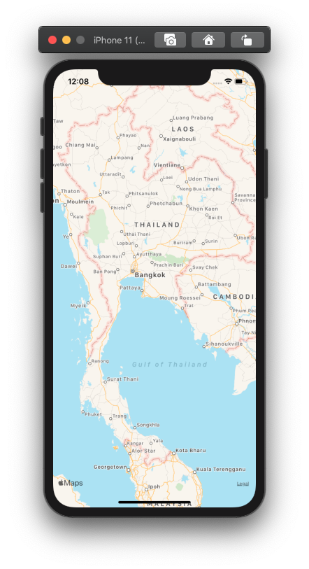
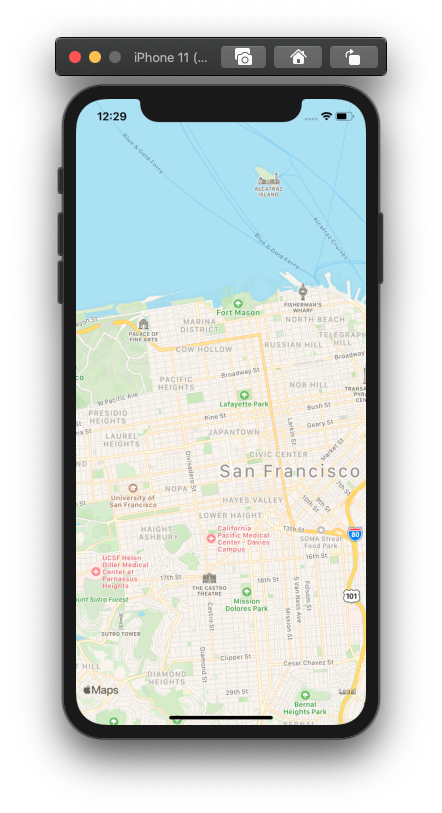
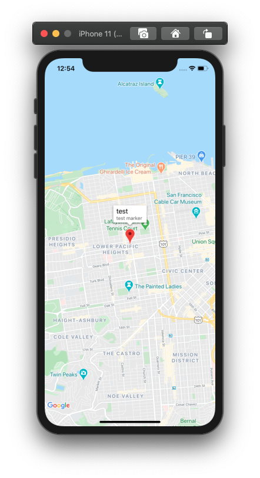
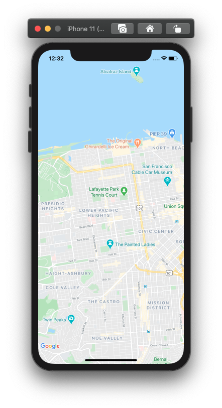

this tutorial we learn how to use maps on react native . maps is fundamental thing that we need to know this package your can start with install react-native-maps package with yarn or npm is support both Google and Apple maps

this package maintain by [react native community](https://github.com/react-native-community)

```jsx
yarn add react-native-maps
```

## Setup

### **ios**

Using CocoaPods (React Native 0.60 and higher)

```jsx
cd ios
pod install
```

**App store submission**

The app's `Info.plist` file must contain a `NSLocationWhenInUseUsageDescription` with a user-facing purpose string explaining clearly and completely why your app needs the location, otherwise Apple will reject your app submission.

**Enabling Google Maps on iOS (React Native all versions)**

If you want to enable Google Maps on iOS, obtain the Google API key and edit your `AppDelegate.m` as follows:

```swift
+ #import <GoogleMaps/GoogleMaps.h>
@implementation AppDelegate
...
- (BOOL)application:(UIApplication *)application didFinishLaunchingWithOptions:(NSDictionary *)launchOptions
{
+ [GMSServices provideAPIKey:@"_YOUR_API_KEY_"]; // add this line using the api key obtained from Google Console
...
```

The `[GMSServices provideAPIKey]` should be the **first call** of the method.

### Android

Ensure your build files match the following requirements:

1. (React Native 0.59 and lower) Define the `react-native-maps` project in `android/settings.gradle`:

```swift
...
include ':react-native-maps'
project(':react-native-maps').projectDir = new File(rootProject.projectDir, '../node_modules/react-native-maps/lib/android')
```

1. (React Native 0.59 and lower) Add the `react-native-maps` as an dependency of your app in `android/app/build.gradle`:

```swift
...
dependencies { ... implementation project(':react-native-maps')
}
```

3.1 (React Native all versions) If you've defined *[project-wide properties](https://developer.android.com/studio/build/gradle-tips.html)* (**recommended**) in your root `build.gradle`, this library will detect the presence of the following properties:

```java
buildscript {...}
allprojects {...}
/** + Project-wide Gradle configuration properties */
ext { compileSdkVersion = xxx targetSdkVersion = xxx buildToolsVersion = "xxx" minSdkVersion = xxx supportLibVersion = "xxx" playServicesVersion = "17.0.0" // or find latest version androidMapsUtilsVersion = "xxx"
}
```

or do

```java
buildscript {
    ext {
        buildToolsVersion = "xxx"
        minSdkVersion = xxx
        compileSdkVersion = xxx
        targetSdkVersion = xxx
        supportLibVersion = "xxx"
        playServicesVersion = "17.0.0" // or find latest version
        androidMapsUtilsVersion = "xxx"
    }
}
...

```

You can find the latest `playServicesVersion` by checking [https://developers.google.com/android/guides/releases](https://developers.google.com/android/guides/releases) and searching for `gms:play-services-maps:`

3.2 (React Native all versions) If you do **not** have *project-wide properties* defined and have a different play-services version than the one included in this library, use the following instead (switch 17.0.0 and/or 17.2.1 for the desired versions):

```java
...
dependencies {
   ...
   implementation(project(':react-native-maps')){
       exclude group: 'com.google.android.gms', module: 'play-services-base'
       exclude group: 'com.google.android.gms', module: 'play-services-maps'
   }
   implementation 'com.google.android.gms:play-services-base:17.2.1'
   implementation 'com.google.android.gms:play-services-maps:17.0.0'
}
```

1. (React Native all versions) Specify your Google Maps API Key:

   Add your API key to your manifest file (`android/app/src/main/AndroidManifest.xml`):

```xml
<application>
   <!-- You will only need to add this meta-data tag, but make sure it's a child of application -->
   <meta-data
     android:name="com.google.android.geo.API_KEY"
     android:value="Your Google maps API Key Here"/>

   <!-- You will also only need to add this uses-library tag -->
   <uses-library android:name="org.apache.http.legacy" android:required="false"/>
</application>
```

> Note: As shown above, com.google.android.geo.API_KEY is the recommended metadata name for the API key. A key with this name can be used to authenticate to multiple Google Maps-based APIs on the Android platform, including the Google Maps Android API. For backwards compatibility, the API also supports the name com.google.android.maps.v2.API_KEY. This legacy name allows authentication to the Android Maps API v2 only. An application can specify only one of the API key metadata names. If both are specified, the API throws an exception.

Source: [https://developers.google.com/maps/documentation/android-api/signup](https://developers.google.com/maps/documentation/android-api/signup)

1. (React Native 0.59 and lower) Add `import com.airbnb.android.react.maps.MapsPackage;` and `new MapsPackage()` in your `MainApplication.java` :

```xml
import com.airbnb.android.react.maps.MapsPackage;
...
    @Override
    protected List<ReactPackage> getPackages() {
        return Arrays.<ReactPackage>asList(
                new MainReactPackage(),
                new MapsPackage()
        );
    }
```

1. (React Native all versions) Ensure that you have Google Play Services installed:

- For the Genymotion emulator, you can follow [these instructions](https://www.genymotion.com/help/desktop/faq/#google-play-services).
- For a physical device you need to search on Google for 'Google Play Services'. There will be a link that takes you to the Play Store and from there you will see a button to update it (do not search within the Play Store).

That's it, you made it! 👍

### Example 1

just start with basic example with full screen maps by set device width and height

```jsx
import React from "react";
import MapView from "react-native-maps";
import { StyleSheet, Text, View, Dimensions } from "react-native";

export default class App extends React.Component {
  render() {
    return (
      <View style={styles.container}>
        <MapView style={styles.mapStyle} />
      </View>
    );
  }
}

const styles = StyleSheet.create({
  container: {
    flex: 1,
    backgroundColor: "#fff",
    alignItems: "center",
    justifyContent: "center",
  },
  mapStyle: {
    width: Dimensions.get("window").width,
    height: Dimensions.get("window").height,
  },
});
```

your will saw full screen map in result



### Example 2 : add initial region

we try add initial region to maps

```jsx
<MapView
  initialRegion={{
    latitude: 37.78825,
    longitude: -122.4324,
    latitudeDelta: 0.0922,
    longitudeDelta: 0.0421,
  }}
  style={styles.mapStyle}
/>
```

output



### Example 3:Rendering a list of markers on a map

for adding marker your can do like this first setup marker position

```jsx
state = {
  marker: {
    latitude: 37.78825,
    longitude: -122.4324,
    latitudeDelta: 0.0922,
    longitudeDelta: 0.0421,
  },
};
```

then import Marker component

```jsx
import MapView, { PROVIDER_GOOGLE, Marker } from "react-native-maps";
```

wrap by MapView component

```jsx
<MapView
  provider={PROVIDER_GOOGLE}
  initialRegion={{
    latitude: 37.78825,
    longitude: -122.4324,
    latitudeDelta: 0.0922,
    longitudeDelta: 0.0421,
  }}
  style={styles.mapStyle}
>
  <Marker
    coordinate={this.state.marker}
    title={"test"}
    description={"test marker"}
  />
</MapView>
```

Output:



### Example 4 : using Google Maps

for iOS initial maps was set to Apple maps if your want to swtich to Google maps just specify map provider as example

```jsx
import MapView, { PROVIDER_GOOGLE } from "react-native-maps";
import { StyleSheet, Text, View, Dimensions } from "react-native";

export default class App extends React.Component {
  render() {
    return (
      <View style={styles.container}>
        <MapView
          provider={PROVIDER_GOOGLE}
          initialRegion={{
            latitude: 37.78825,
            longitude: -122.4324,
            latitudeDelta: 0.0922,
            longitudeDelta: 0.0421,
          }}
          style={styles.mapStyle}
        />
      </View>
    );
  }
}
```

Output



### Conclusion

this tutorial we learn how to setup and using React native maps for next step we can add many event and using with other component

### Credit

[react-native-community/react-native-maps](https://github.com/react-native-community/react-native-maps/blob/master/docs/installation.md)
